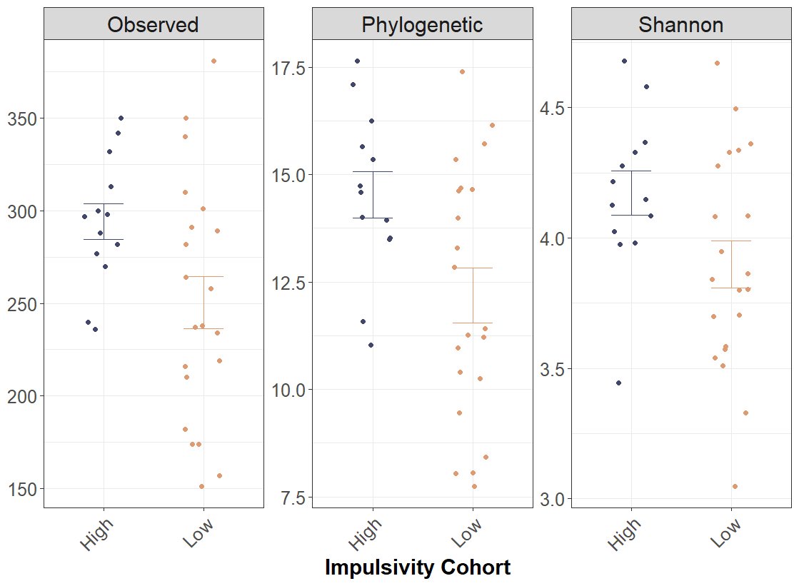
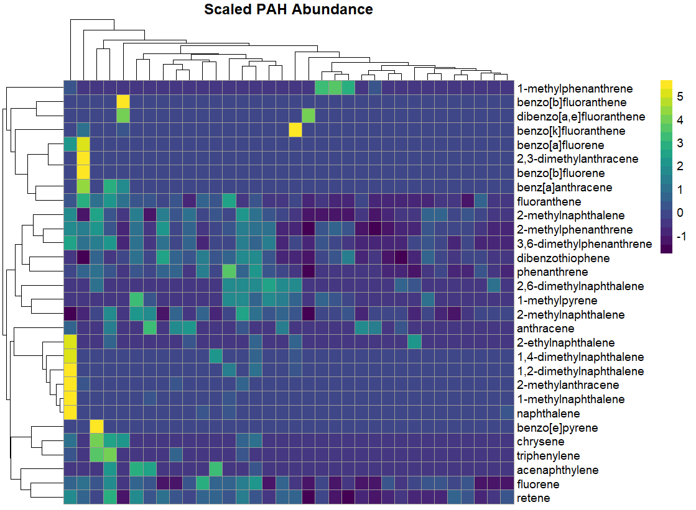
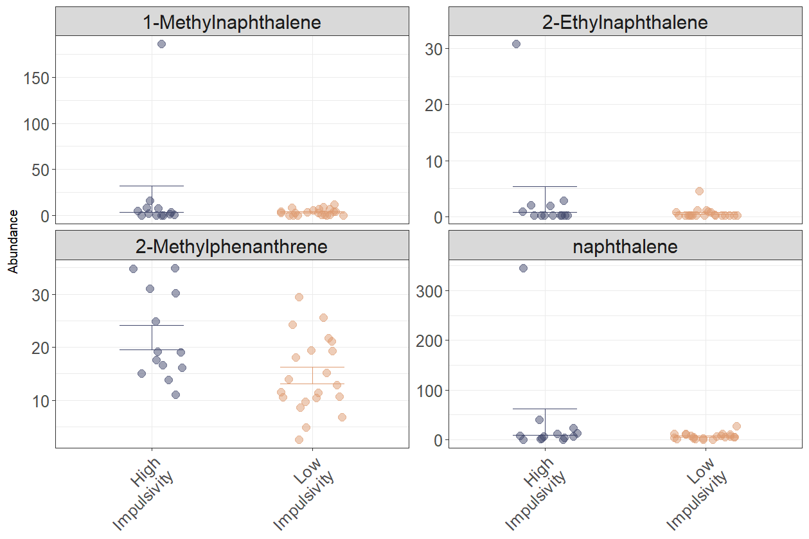
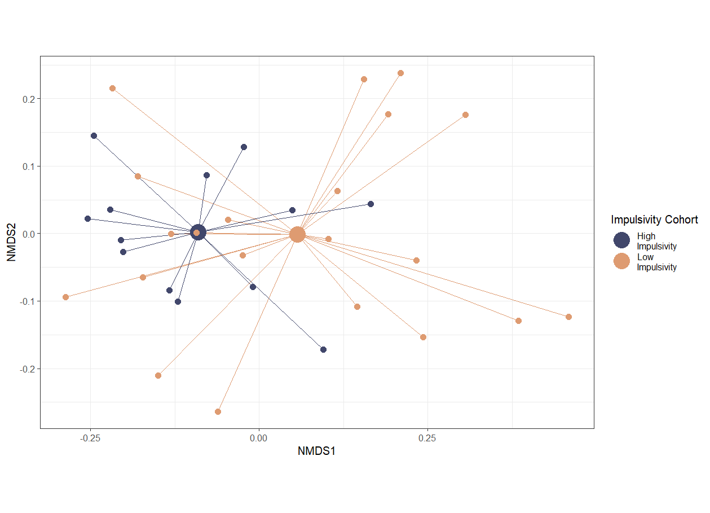
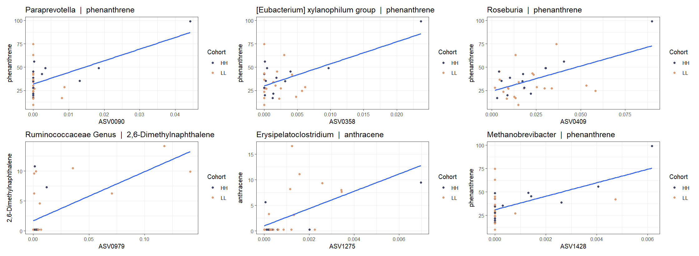

# Gut Microbiome, PAHs, and Impulsivity

## Overview

Polycyclic aromatic hydrocarbons (PAHs), a class of ubiquitous environmental pollutants, pose significant risks to human health, including cognitive function. PAHs enter the human body through various pathways, such as inhalation of polluted air and consumption of contaminated food, and are metabolized within the gut. The gut microbiome, an intricate ecosystem of microorganisms, plays a central role in this metabolic process. Emerging evidence suggests that PAH exposure and alterations in gut microbial communities may intersect to influence impulsivity, a behavioral trait closely tied to cognitive health. This project investigates these complex interactions, using computational biology and multi-omic data integration to reveal novel insights into the gut-brain-environment axis.

*Figure 1: Alpha diversity varies between impulsivity cohorts, suggesting ecological shifts in gut microbial communities.*

## Key Insights

Our analysis uncovers critical links between the gut microbiome, PAH exposure, and impulsivity. **PAH exposure**, visualized through a heatmap of scaled levels across participants, is unevenly distributed across the population. Individuals experience disproportionate exposure to PAHs, which may influence impulsivity or, conversely, may be influenced by it. This bidirectional relationship adds complexity to understanding the gut-brain axis. 

*Figure 2: Heatmap showing the uneven distribution of PAH exposure across participants.*

We also observe that individuals with higher impulsivity display disproportionate PAH exposure levels. This connection, illustrated through a comparison of PAH abundance by impulsivity, reveals patterns that differ by sex, with males showing higher PAH levels than females.

*Figure 3: PAH exposure levels compared to impulsivity metrics reveal disproportionate exposure among high-impulsivity individuals.*

## Gut Microbiome and Impulsivity

The gut microbiome’s composition is strongly correlated with impulsivity, underscoring its role in cognitive traits. Non-metric multidimensional scaling (NMDS) reveals clear stratification of microbial communities based on impulsivity cohorts, suggesting a fundamental ecological shift within the gut.

*Figure 4: NMDS ordination of microbial communities stratified by impulsivity cohorts.*

## Bridging the Connections

The interplay between PAH exposure, gut microbiota, and impulsivity culminates in a striking observation: microbes known to degrade PAHs are directly associated with PAH levels in the gut. These same taxa have previously been implicated in cognitive health, offering a plausible mechanistic pathway. Scatterplots mapping specific microbial taxa to PAH exposure further illustrate this connection, underscoring the role of gut microbes as mediators in the PAH-impulsivity relationship.

*Figure 5: Specific microbial taxa respond to PAH exposure, linking gut microbiota to environmental pollutant levels and cognitive outcomes.*

Together, these findings weave a compelling narrative: environmental pollutants, microbial ecosystems, and cognitive health are intricately linked through the gut-brain axis, providing fertile ground for future research and potential therapeutic strategies.

---

*This repository provides the data, scripts, and visualizations used in this study, offering a reproducible framework for further exploration.*

